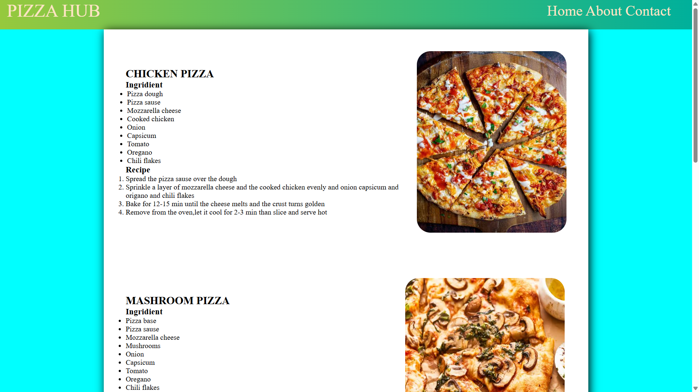
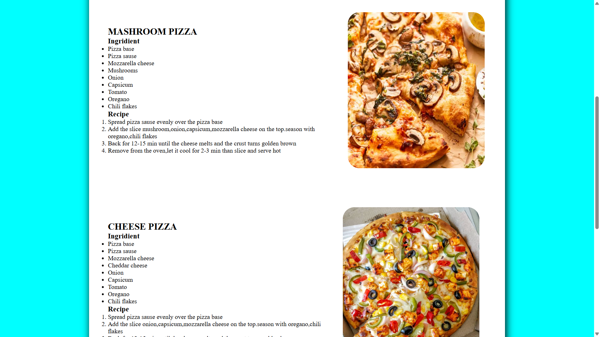
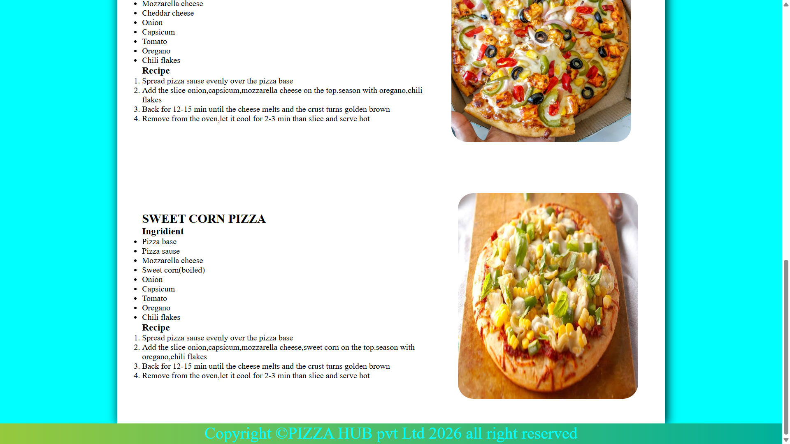

# 🍕 Cookify — Food Recipe Website

A clean and modern **Food Recipe Website** built with HTML and CSS, designed to present delicious recipes in a simple, attractive, and easy-to-read format.

> **Explore recipes. Discover ingredients. Cook something delicious. 👩‍🍳**

## ✨ Features

- 🍕 Multiple food recipes
- 🥗 Clear ingredient lists
- 👨‍🍳 Step-by-step cooking instructions
- 🖼️ Food images for visual presentation
- 📱 Clean and user-friendly layout
- 🎨 Modern recipe-card style design
- 🌐 Built with beginner-friendly front-end technologies

## 🛠️ Technologies Used

- **HTML5** — Website structure and semantic content
- **CSS3** — Styling, layout, spacing, colors and responsive design

## 📂 Project Structure

```text
Cookify/
│
├── index.html
├── pizza.html
├── style.css
├── images/
│   └── ...
└── README.md
```

> Update the file/folder names above if your actual project structure is different.

## 🍽️ Recipes

The project currently includes recipes such as:

- 🍕 Chicken Pizza
- 🍄 Mushroom Pizza
- And more recipes can be added easily.

Each recipe contains:
- Ingredients
- Preparation steps
- Cooking/baking instructions
- Food image

## 🎯 Project Goal

The goal of this project is to create a simple but professional recipe platform where users can quickly find a recipe, check the required ingredients, and follow the cooking process step by step.

This project also demonstrates practical front-end development concepts such as:

- HTML structure
- CSS layouts
- Navigation
- Images
- Typography
- Spacing and alignment
- Responsive web design

## 🚀 How to Run

1. Clone this repository:

```bash
git clone https://github.com/YOUR-USERNAME/YOUR-REPOSITORY.git
```

2. Open the project folder.
3. Open `index.html` in your browser.

You can also use **VS Code + Live Server** for a better development experience.


## 📸 Project Preview

<p align="center">
  
  
  
</p>


## 🔮 Future Improvements

Planned improvements for future versions:

- 🔍 Recipe search
- 🏷️ Food categories
- ❤️ Favorite recipes
- ⭐ Recipe ratings
- 📱 Improved mobile responsiveness
- 🧾 Recipe detail pages
- 🌙 Dark mode
- ⚡ JavaScript-based interactive features

## 👩‍💻 Author

**Ankita Pradhan**

B.Tech Computer Science & Engineering

---

⭐ If you like this project, consider giving the repository a **star**!

**Made with ❤️ and a passion for food & web development.**
